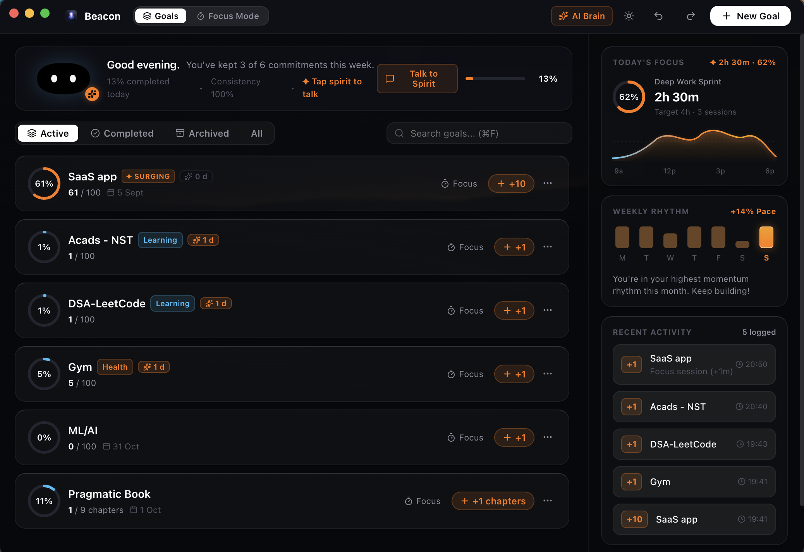
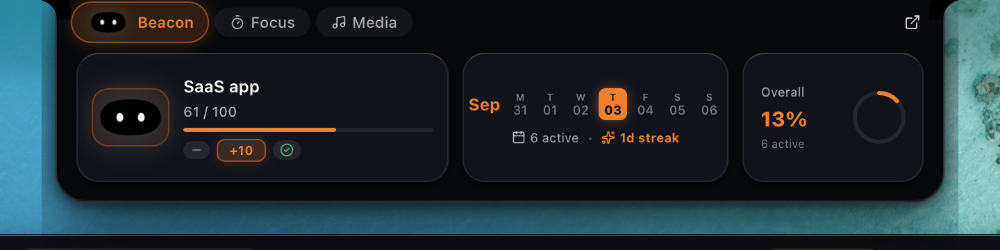
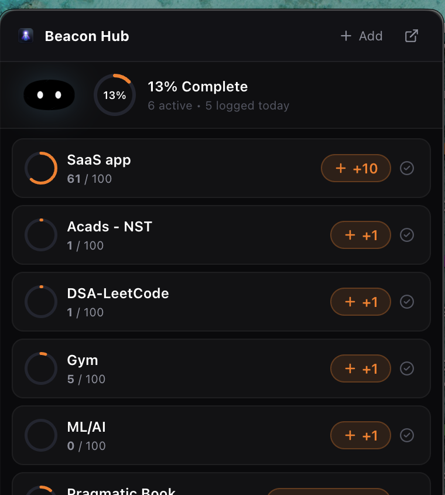
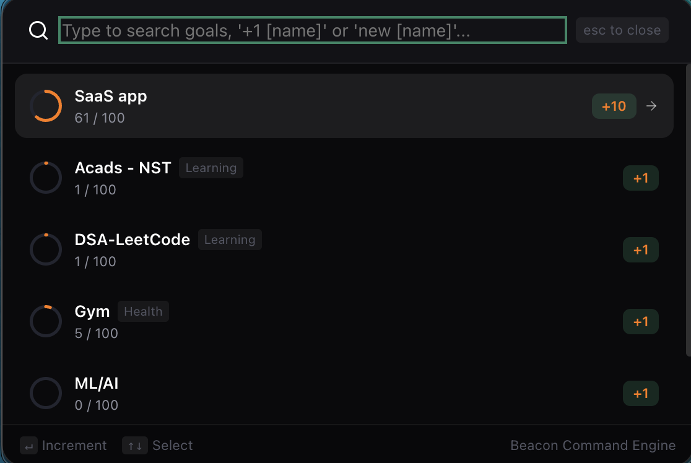
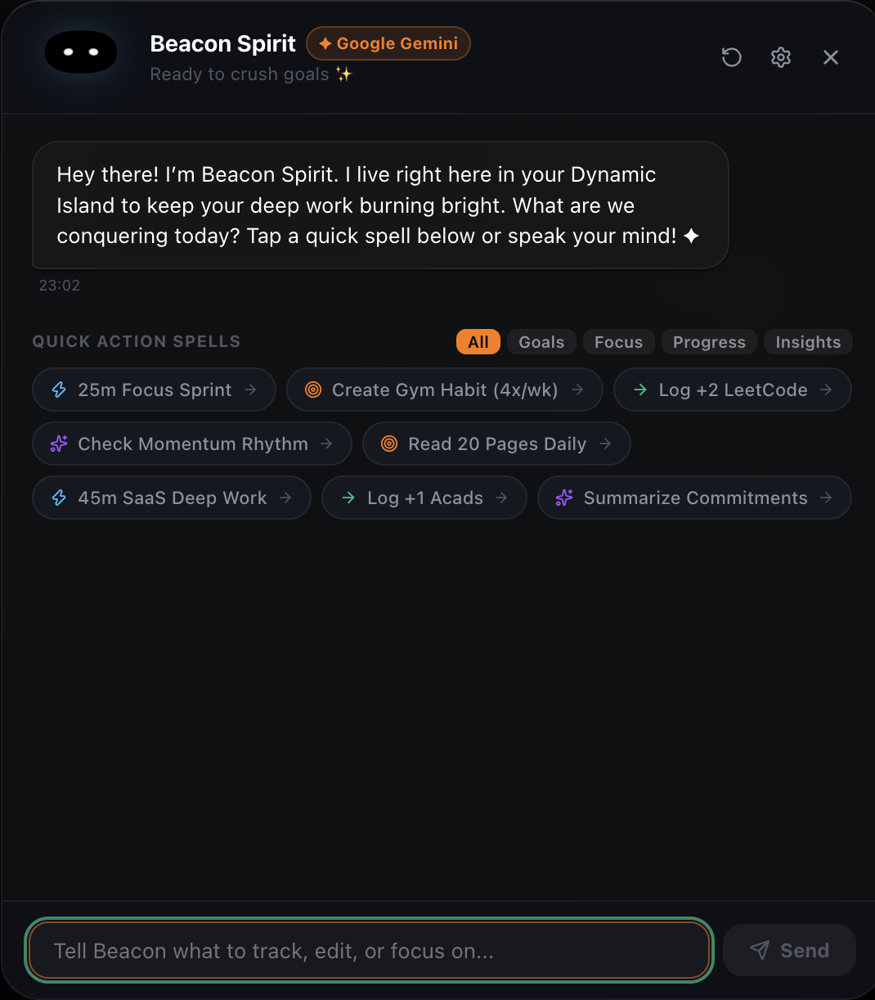

<div align="center">

  

  # Beacon — The Intentional Dynamic Island for macOS

  **Turn your MacBook notch into a living hardware HUD, habit engine, and autonomous AI companion workspace.**

  [](https://opensource.org/licenses/MIT)
  [](https://apple.com)
  [](https://vitejs.dev)
  [](https://react.dev)
  [](https://beacon.tarunya.me)

  [**Live Website**](https://beacon.tarunya.me) • [**GitHub**](https://github.com/tarunyaprogrammer) • [**LinkedIn**](https://www.linkedin.com/in/tarunyakesharwani/)

</div>

---

## ✦ Created & Architected By

**Tarunya Kesharwani**  
- **GitHub**: [@tarunyaprogrammer](https://github.com/tarunyaprogrammer)  
- **LinkedIn**: [linkedin.com/in/tarunyakesharwani](https://www.linkedin.com/in/tarunyakesharwani/)  
- **Personal Portfolio**: [tarunya.me](https://tarunya.me)

---

## ✦ Real macOS Application Surfaces

<div align="center">

### 1. The Main Obsidian Command Dashboard
*Complete overview of active commitments, deep-work waveforms, and weekly momentum rhythm.*
<br/>


<br/><br/>

### 2. The Hardware Dynamic Island Notch
*Snaps seamlessly beneath your MacBook camera notch with live 3-column glanceability.*
<br/>


<br/><br/>

### 3. Menu Bar Hub & Command Engine
*Glanceable popover from the macOS system tray and Spotlight-speed keyboard palette.*
<br/>



<br/><br/>

### 4. Beacon Spirit AI Companion
*Sub-second (~930ms) Google Gemini companion with 1-click Quick Action Spells and natural speech pacing.*
<br/>


</div>

---

## ✦ Core Value Pillars

1. **Zero-Distance Hardware HUD**: Lives in the dead space of the MacBook notch. Snaps behind the camera bezel and smoothly expands on hover or via `⌘⇧B`.
2. **6 Human Behavioral Paradigms**:
   - **Habit Engine**: Daily & weekly frequency routines with streak guard.
   - **Accumulative Targets**: Measurable volume targets (e.g. 500 LeetCode problems) with quick `[+10]` increment actions.
   - **Deadline Burn-down**: Real-time ship date countdowns and velocity pacing.
   - **Milestone Roadmaps**: Phased multi-step project roadmaps with audio chimes.
   - **Duration Sprints**: Synchronized deep-work hours tracking.
   - **Avoidance Guardian**: Clean-day counters and relapse recovery logging.
3. **0.1% Idle CPU & SQLite WAL Mode**: Zero battery drain, throttles to 0 FPS when collapsed, and 100% local private data persistence.
4. **Anti-Subscription Philosophy**: One-time **$29 Pioneer Lifetime Deal** with zero recurring fees.

---

## ✦ Payment Gateway (Razorpay Integration)

The marketing website includes a production-grade checkout bridge powered by **Razorpay Standard Checkout**:
- **Supported Payment Modes**: UPI (Google Pay, PhonePe, Paytm), Credit & Debit Cards (Visa, Mastercard, Amex), NetBanking, and Apple Pay.
- **Built-in Instant Sandbox Mode**: Enables testing the full end-to-end checkout and post-payment license delivery immediately without requiring live bank credentials.
- **Configuring Live Razorpay Keys**:
  Open `src/services/razorpay.ts` and set your key:
  ```ts
  export const RAZORPAY_CONFIG = {
    keyId: "rzp_live_YOUR_KEY_HERE", // Replace with your live Razorpay Key
    currencyINR: "INR",
    currencyUSD: "USD",
  };
  ```

---

## ✦ Search Engine Optimization (SEO) & Google Analytics

This website is pre-configured for maximum Google search indexation and rich snippets:
- **Linked Data Graph (`Schema.org JSON-LD`)**: Defines `SoftwareApplication`, `Person` (Tarunya Kesharwani), and `WebSite`.
- **OpenGraph & Twitter Cards**: 1200×630 pixel-perfect social preview banner (`/og-image.png`).
- **Google Search Console Verification**: Edit the verification meta tag in `index.html`:
  ```html
  <meta name="google-site-verification" content="YOUR_GSC_VERIFICATION_TOKEN" />
  ```
- **Google Analytics 4 (GA4)**: Replace `G-BEACONID` in `index.html` with your live measurement ID:
  ```html
  <script async src="https://www.googletagmanager.com/gtag/js?id=G-YOUR_MEASUREMENT_ID"></script>
  ```
- **Sitemap & Robots**: Pre-generated `/sitemap.xml` and `/robots.txt` prioritizing `https://beacon.tarunya.me`.

---

## ✦ Deployment to `beacon.tarunya.me`

### Option 1: Vercel (Recommended)
1. Push this repository to GitHub.
2. In Vercel, import the repo and select **Vite** preset.
3. Under **Settings → Domains**, add `beacon.tarunya.me`.
4. In your DNS provider (Cloudflare/Namecheap) for `tarunya.me`:
   - **Type**: `CNAME`
   - **Name**: `beacon`
   - **Target**: `cname.vercel-dns.com`

### Option 2: Cloudflare Pages
1. In Cloudflare Dashboard → Workers & Pages → Connect Repository.
2. Set Build command: `npm run build` | Output directory: `dist`.
3. Add custom domain `beacon.tarunya.me` (zero-configuration DNS proxy).

---

## ✦ Local Development & Build

```bash
# Install dependencies
npm install

# Start local dev server (http://localhost:3000)
npm run dev

# Run type check and production build (<80 kB gzipped in <250ms)
npm run build

# Preview production build locally
npm run preview
```

---

<div align="center">

Crafted with craft for macOS by **Tarunya Kesharwani**  
[GitHub](https://github.com/tarunyaprogrammer) • [LinkedIn](https://www.linkedin.com/in/tarunyakesharwani/) • [beacon.tarunya.me](https://beacon.tarunya.me)

</div>
